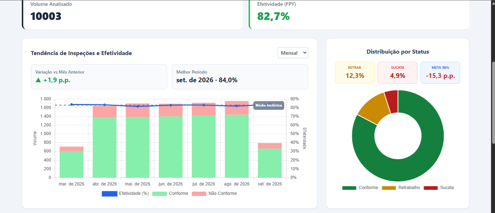
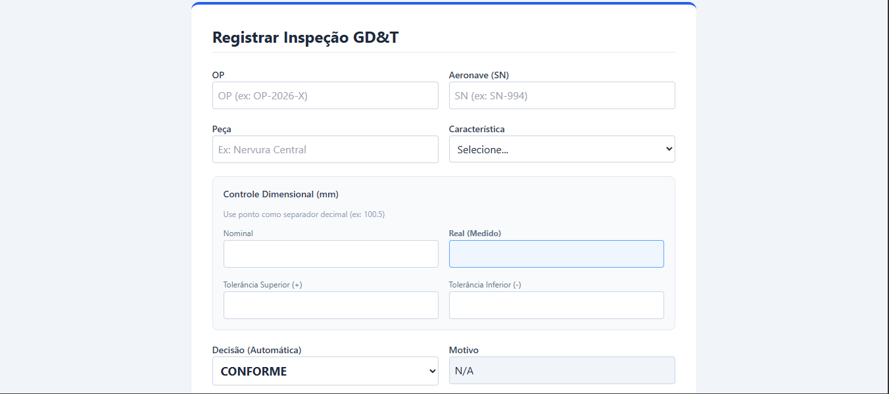
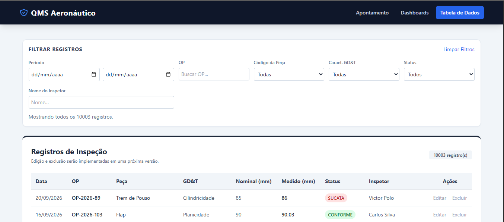

# QMS Aeronáutico — Sistema de Qualidade e Metrologia

Ferramenta interna para registro e análise de inspeções dimensionais GD&T em peças aeronáuticas. Cobre todo o ciclo: apontamento em chão de fábrica, dashboards executivos e consulta analítica.

> 🔗 **Demo online:** [main](https://github.com/VictorPolo2005/metrologia-qms)
> 🎬 **Vídeo de demonstração:** [demo-qms.mp4](./docs/demo-qms.mp4)
> 📸 **Prints:** [`/docs`](./docs)

## 📸 Demonstração

### Sistema em ação

<video src="./docs/demo-qms.mp4" controls autoplay loop muted width="800"></video>

### Dashboard Executivo


### Apontamento de Inspeção


### Consulta com filtros e paginação


## ✨ Funcionalidades

### Apontamento
- Registro de inspeções com cálculo **automático de status** por tolerância
  - Regra de negócio: dentro da faixa = **CONFORME**; até 3× a tolerância = **RETRABALHO**; acima = **SUCATA**
- Campo "Motivo" travado/destravado dinamicamente conforme o status
- Timestamp automático no momento do registro

### Dashboard Executivo
- KPIs de Volume e Efetividade (FPY) com meta configurável (98%)
- **3 gráficos interativos:**
  - Distribuição por status (rosca)
  - Pareto de defeitos (ranking de motivos de não conformidade)
  - Tendência temporal com barras empilhadas + linha de efetividade + linha de referência da média histórica
- Cards complementares com storytelling executivo (variação vs mês anterior, ofensor #1, top 3 concentração, gap da meta)
- **Filtros reativos estilo Power BI** com cascata bidirecional — mudar um filtro recalcula as opções disponíveis dos outros

### Consulta
- Tabela paginada (25 registros por página)
- Filtros reativos próprios (independentes do dashboard)
- Debounce de 300ms nos inputs de texto (performance com 10.000+ registros)
- Limites de data calculados a partir do range real dos dados

## 🏗️ Arquitetura

Refatoração de um único arquivo de **1.000+ linhas** para **6 módulos ES** com responsabilidades bem definidas:

| Arquivo | Responsabilidade |
|---|---|
| `api.js` | Cliente Supabase + estado em memória (classe com campos privados + EventTarget) |
| `navegacao.js` | Troca de abas (SPA) + overlay de carregamento com progresso |
| `apontamento.js` | Formulário de registro + cálculo automático de status |
| `dashboards.js` | KPIs, 3 gráficos Chart.js, filtros em cascata |
| `tabela.js` | Tabela paginada + filtros próprios + debounce |

### Comunicação entre módulos

O `api.js` é o **dono dos dados brutos** e dispara eventos customizados via `EventTarget`:

- `carregando` — quando inicia uma busca no banco
- `progresso` — a cada lote de 1.000 registros carregado
- `atualizados` — quando os dados estão prontos

Os outros módulos **importam** o `api` e reagem aos eventos. Não há acoplamento direto entre `dashboards.js`, `tabela.js` e `apontamento.js` — eles nem sabem que os outros existem.

## 🛠️ Stack

- **JavaScript Vanilla** (ES Modules nativos)
- **Tailwind CSS** (via CDN)
- **Chart.js** + `chartjs-plugin-annotation` (gráficos)
- **Supabase** (Postgres + API REST + SDK JS)

## 🚀 Como rodar localmente

```bash
# 1. Clone o repositório
git clone https://github.com/VictorPolo2005/metrologia-qms.git
cd metrologia-qms

# 2. Configure suas credenciais do Supabase
#    Edite api.js e troque SUPABASE_URL e SUPABASE_ANON_KEY

# 3. Sirva localmente (necessário para ES Modules funcionarem)
python3 -m http.server 8000
```

Ou, se preferir, abra a pasta no VS Code e use a extensão **Live Server**.

Acesse `http://localhost:8000` no navegador.

> **Por que precisa de servidor?** Módulos ES (`<script type="module">`) são bloqueados por CORS quando abertos via `file://`. É uma medida de segurança do navegador.

## 🗄️ Banco de dados

A tabela `inspecoes_aeronauticas` (Supabase/Postgres) armazena:

| Campo | Tipo | Descrição |
|---|---|---|
| `id` | uuid | Chave primária |
| `ordem_fabricacao` | text | Ordem de fabricação (OP) |
| `numero_aeronave` | text | Número de série da aeronave |
| `codigo_peca` | text | Código da peça inspecionada |
| `caracteristica_gdt` | text | Planicidade / Cilindricidade / Posição / Batimento |
| `valor_nominal` | numeric | Valor nominal (mm) |
| `valor_medido` | numeric | Valor medido (mm) |
| `tolerancia_superior` | numeric | Tolerância superior (mm) |
| `tolerancia_inferior` | numeric | Tolerância inferior (mm) |
| `status` | text | CONFORME / RETRABALHO / SUCATA |
| `motivo_nao_conformidade` | text | Motivo (quando não conforme) |
| `registro_inspetor` | text | Matrícula do inspetor |
| `nome_inspetor` | text | Nome do inspetor |
| `data_hora_inspecao` | timestamptz | Timestamp do registro |

## 📚 Decisões de arquitetura

- **Por que classe com campos privados (`#registros`)?** Garantir encapsulamento real — nenhum módulo externo pode modificar o estado diretamente, só via métodos da API. Isso evita bugs difíceis de rastrear.
- **Por que `EventTarget` em vez de callbacks?** Permite múltiplos ouvintes sem acoplamento (o padrão nativo do DOM), e um módulo não precisa saber quantos outros estão escutando.
- **Por que filtros em cascata no dashboard?** Replica o comportamento do Power BI, evitando que o usuário escolha combinações que resultariam em conjunto vazio. Cada filtro recalcula as opções válidas dos outros.
- **Por que debounce nos filtros de texto?** Com 10.000+ registros, aplicar filtro a cada tecla seria desperdício; 300ms de espera elimina ~90% das execuções.
- **Por que dois conjuntos de filtros (dashboard e tabela)?** São contextos diferentes: o dashboard analisa tendências agregadas; a tabela busca registros individuais. Misturar criaria acoplamento desnecessário.

## 🎯 Possíveis evoluções

- [ ] Autenticação com Supabase Auth + perfis (admin / inspetor / visualizador)
- [ ] Edição e exclusão de registros com trilha de auditoria
- [ ] Exportação para Excel/PDF
- [ ] Ação sugerida automática no Pareto (baseada nos ofensores mais frequentes)
- [ ] Filtros com "X" individual (limpar um filtro por vez)

## 👤 Autor

**Victor Polo**

- 💼 [LinkedIn](https://www.linkedin.com/in/victor-polo-2964b4233/)
- 📧 [vpolo4858@gmail.com](mailto:vpolo4858@gmail.com)

Projeto desenvolvido como ferramenta interna para a área de qualidade e como estudo de arquitetura de front-end modular em JavaScript Vanilla.
